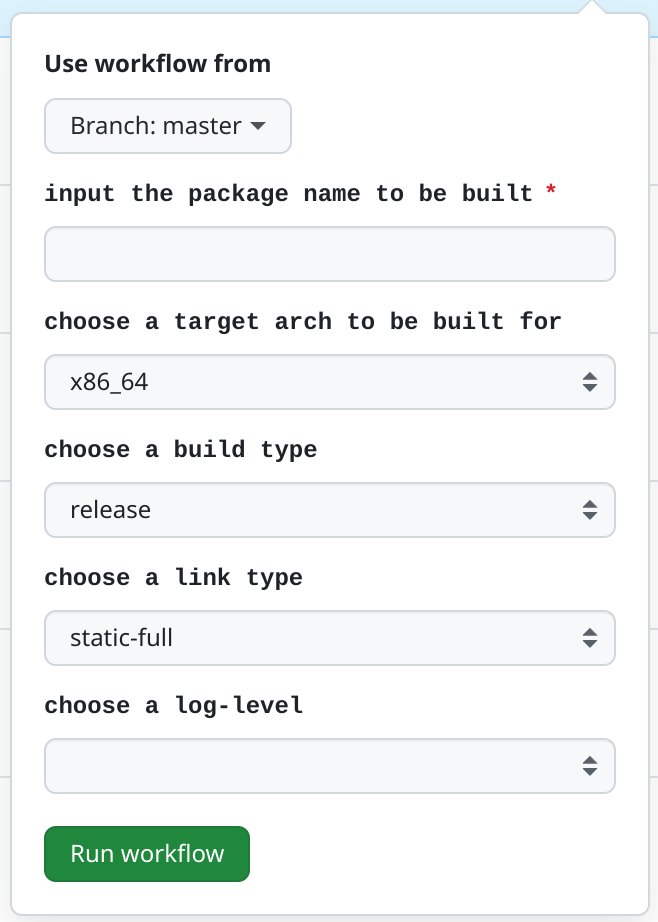

# ppkg-package-manually-build

manually build packages using ([ppkg](https://github.com/leleliu008/ppkg)) via GitHub Actions.

In this way, you will be liberated from the rut of setting up the build environemt.

In this way, all you need to do is just clicking the buttons and waiting for finishing. After finishing, a url refers to a zip archive will be provided to download.

||
|-|
||

## how to use this project

**step1: fork this repository into your own github account**

**step2: manually run the GitHub Actions workflow to build a package**

Reference: <https://docs.github.com/en/actions/using-workflows/manually-running-a-workflow>

**step3: download the artifact**

Reference: <https://docs.github.com/en/actions/managing-workflow-runs/downloading-workflow-artifacts>
